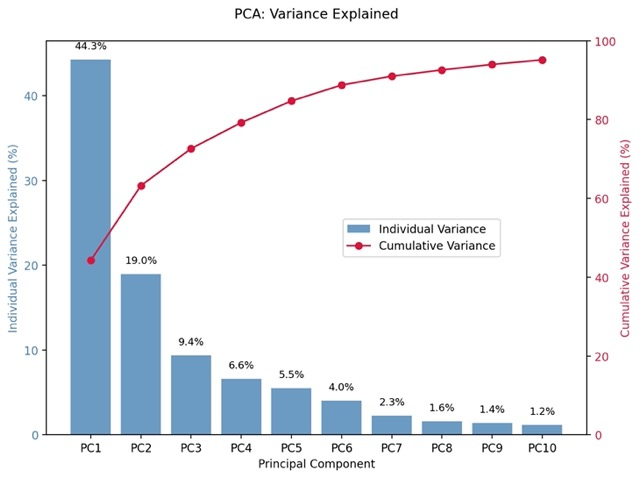

# 📊 Unsupervised Machine Learning App — PCA & K-Means Clustering

## 🔍 Project Overview

This interactive Streamlit app allows users to explore **unsupervised machine learning techniques** using either a built-in breast cancer dataset or a custom CSV upload. The app implements **Principal Component Analysis (PCA)** and **K-Means Clustering**, providing intuitive controls to tune parameters and visualize results.

### ✅ Users can:
- Upload their own datasets or use the built-in breast cancer data
- Choose which columns to analyze
- Adjust key hyperparameters (number of PCA components or clusters)
- Visualize PCA variance and clustering results with clear, annotated plots
- For **K-Means Clustering**, users can:
  - Select the number of clusters (`k`)
  - View the silhouette score to evaluate clustering quality
  - See clusters displayed in 2D space (via PCA reduction)

## 🛠️ Instructions

### ✅ How to Run Locally:

1. **Clone this repo**:
   ```bash
   git clone https://github.com/ArisC123/Cardoso-Data-Science-Portfolio.git
   cd Cardoso-Data-Science-Portfolio/MLUnsupervisedApp
   
2. **Install Required Libraries**
   ```bash
   pip install -r requirements.txt
   
3.  **Run the App**
   ```bash
   streamlit run main.py
   ```

## 🧠 App Features

This app allows users to explore unsupervised machine learning by selecting and tuning two powerful models:

#### 🔀 Model Selection
Users can choose between:
- **Principal Component Analysis (PCA)** – for dimensionality reduction and visualization
- **K-Means Clustering** – for identifying natural groupings within the data

#### ⚙️ Hyperparameter Controls
- For **PCA**, users can:
  - Select the number of principal components to retain (via slider)
- For **K-Means**, users can:
  - Select the number of clusters (`k`)


#### 📊 Model Performance Feedback
- **PCA Outputs:**
  - Explained variance ratio and cumulative variance plots (bar + line chart)
  - 2D scatter plot of the data projected into principal component space
  - Comparison of logistic regression accuracy on original vs. PCA-reduced data

- **K-Means Outputs:**
  - Cluster assignments visualized in 2D using PCA-reduced dimensions
  - **Silhouette Score** to evaluate the quality of clustering (higher = better)
  - **Elbow Method** plot using Within-Cluster Sum of Squares (WCSS) to help choose the optimal number of clusters
  - Optional: true label visualization when using datasets with known target classes

## 📈 Visual Examples


## 📚 References
Below are the resources used to build this project. Feel free to explore them for your own work.  

- [Pandas Cheat Sheet](https://pandas.pydata.org/Pandas_Cheat_Sheet.pdf)
- [Step-by-Step Guide to PCA](https://www.turing.com/kb/guide-to-principal-component-analysis)
