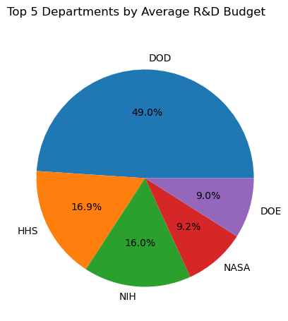

# 🎯 Welcome to The Federal R&D Budget Dataset Exploration

## 📄 Overview 
### **📌 Project Goal**:
The goal of this project is to analyze the relationship between 📈 **GDP** and Federal **R&D Budgets** (by department), with a focus on understanding how research and development investments correlate with economic growth. The project utilizes **Pandas** and **Matplotlib**.

### 📊 Tidy Data Principles:
This project uses the **Tidy Data** framework, which promotes a well-organized data structure designed to enhance clarity, simplify analysis, and improve visualization. 

According to the Tidy Data framework, a dataset must follow these three principles:

1️⃣ Each variable forms a column  
2️⃣ Each observation forms a row  
3️⃣ Each type of observational unit forms a table  

---

## 🛠️ Instructions
### **💻 How to Run the Notebook**

Follow these simple steps to run the notebook:

1. **📥 Install Dependencies** 
   Run the following command in your terminal or command prompt to install the required libraries:  
   ```bash
   pip install pandas matplotlib notebook
2. **📂 Download the Project Files**

3. **🚀 Open and Run the Notebook**
- Navigate to the project folder in Jupyter.
- Open the notebook file (e.g., TidyData_Analysis.ipynb
- Run Each Cell  or just choose Run All at the top of the notebook


##  About the Data Set

- Includes data on **federal departments**, their **R&D budgets**, and **GDP** from **1967 to 2017**.  
- Each row represents a unique combination of **department**, **year**, and **budget** data.  
- Covers **14 federal departments** plus an **"Other"** category for miscellaneous R&D spending.  

🗂️ **Data Dictionary for Departments**

Below are the key departments represented in the dataset:

- **DOD** — Department of Defense  
- **NASA** — National Aeronautics and Space Administration  
- **DOE** — Department of Energy  
- **HHS** — Department of Health and Human Services  
- **NIH** — National Institute of Health  
- **NSF** — National Science Foundation  
- **USDA** — U.S. Department of Agriculture  
- **Interior** — Department of Interior  
- **DOT** — Department of Transportation  
- **EPA** — Environmental Protection Agency  
- **DOC** — Department of Commerce  
- **DHS** — Department of Homeland Security  
- **VA** — Department of Veterans Affairs  
- **Other** — Miscellaneous research and development spending across various sectors  

Data Source adapted from *[Federal R&D Budgets](https://github.com/rfordatascience/tidytuesday/blob/main/data/2019/2019-02-12/readme.md)*

## 📈 Visual Examples
Here is an example of a graph that provides insight into the dataset:




## 📚 References
Below are the resources used to build this project. Feel free to explore them for your own work.  

- [Pandas Cheat Sheet](https://pandas.pydata.org/Pandas_Cheat_Sheet.pdf)
- [Tidy  Data Principles](https://vita.had.co.nz/papers/tidy-data.pdf)

